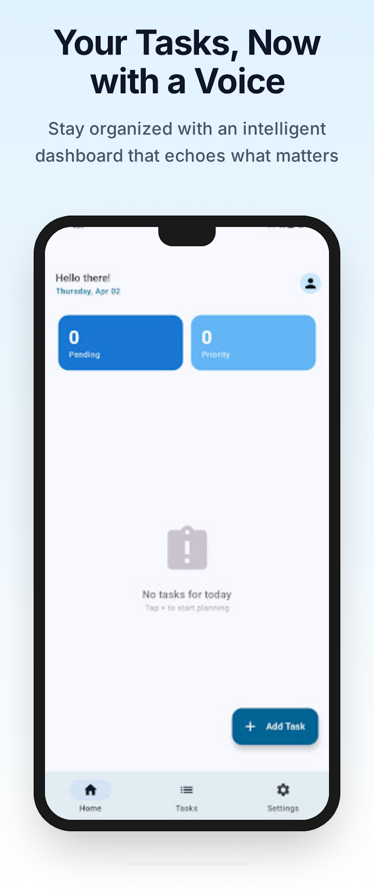
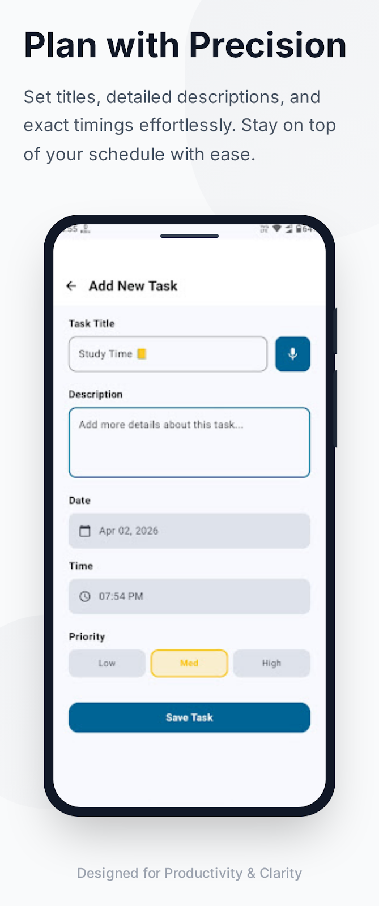
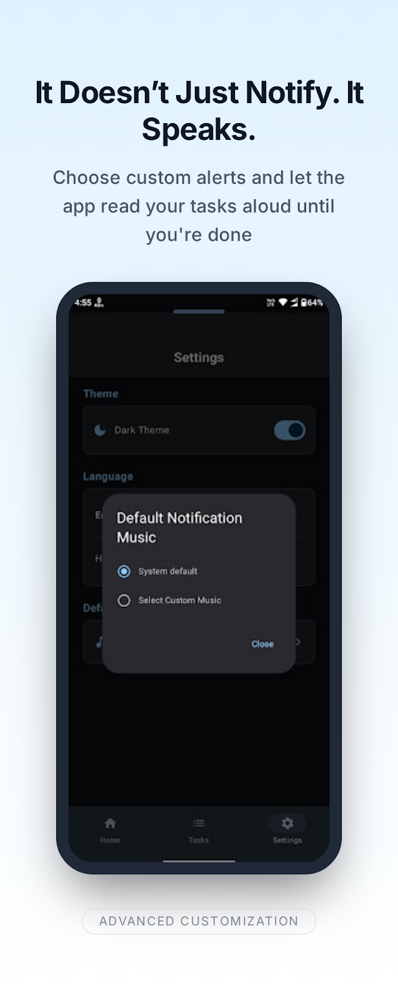
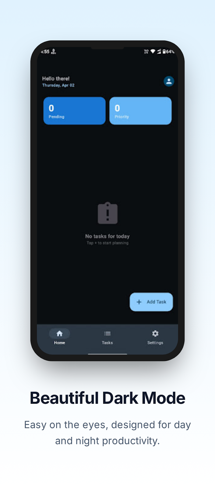
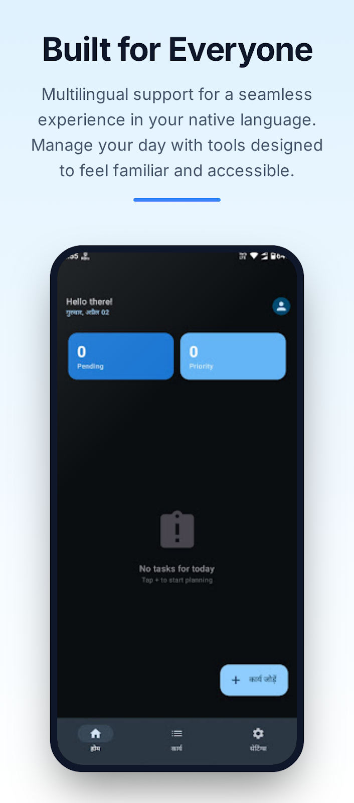

<h1 align="center">Echo Task 🗣️📅</h1>

<p align="center">
  <strong>Your Tasks, Now with a Voice.</strong><br>
  A smart, persistent task reminder application built natively for Android that doesn't just notify you—it speaks to you.
</p>

<p align="center">
  <a href="https://kotlinlang.org"></a>
  <a href="https://developer.android.com/jetpack/compose"></a>
  <a href="https://github.com/dipesht16/EchoTask/releases"></a>
</p>

---

## 📱 Previews

<table align="center" style="border: none; background-color: transparent;">
  <tr style="border: none; background-color: transparent;">
    <td valign="top" style="border: none;"></td>
    <td valign="top" style="border: none;"></td>
    <td valign="top" style="border: none;"></td>
    <td valign="top" style="border: none;"></td>
    <td valign="top" style="border: none;"></td>
  </tr>
</table>

## 🚀 Download & Install
Echo Task is distributed directly to users. 
1. Go to the **[Releases](../../releases)** page.
2. Download the latest `EchoTask-v1.x.x.apk` file.
3. Open the file on your Android device and select "Install" (You may need to allow "Install from unknown sources").

---

## ✨ Features
Unlike standard alarms or calendar notifications, Echo Task bridges the gap between an alarm clock and a to-do list:
* **Persistent Voice Alerts:** Uses Android's Text-to-Speech (TTS) API to repeatedly announce your task out loud (e.g., *"Reminder: Take your medication"*) until you physically stop it.
* **Exact Scheduling:** Utilizes `AlarmManager.setExactAndAllowWhileIdle()` to ensure reminders trigger exactly on time, even in Doze mode.
* **Lock-Screen Bypassing:** High-priority Foreground Services ensure the sticky notification and voice play even if the phone is locked.
* **Beautiful UI:** 100% Jetpack Compose with Material 3 dynamic theming, custom glassmorphism, and seamless Dark Mode support.
* **Multilingual:** Built for global accessibility with UI and Voice support for multiple languages (including Hindi and English).

---

## 🛠️ Technical Architecture
This project is built to production standards, utilizing **MVVM** and **Clean Architecture** principles.

* **UI Layer:** Jetpack Compose, Material 3, StateFlow for reactive state management.
* **Domain Layer:** Clean UseCases encapsulating business logic (e.g., `ScheduleTaskUseCase`, `StopVoiceAlertUseCase`).
* **Data Layer:** * Local Storage: **Room Database** (SQLite).
  * Dependency Injection: **Dagger-Hilt**.
* **Background Processing:** * `BroadcastReceivers` (Boot complete, Time zone changes).
  * `Foreground Services` (TTS execution).

## 💻 Building from Source
If you wish to build the project yourself:
1. Clone the repository:
   ```bash
   git clone [https://github.com/dipesht16/EchoTask.git](https://github.com/dipesht16/EchoTask.git)
